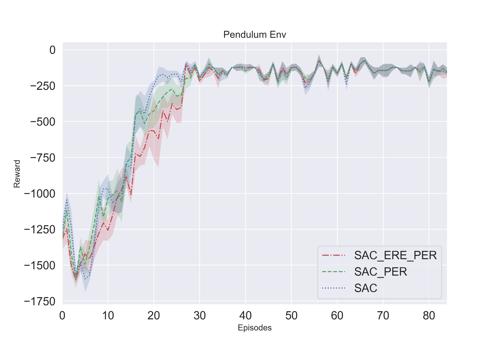
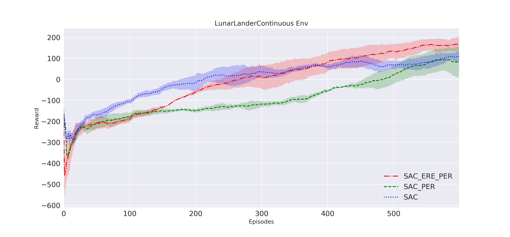
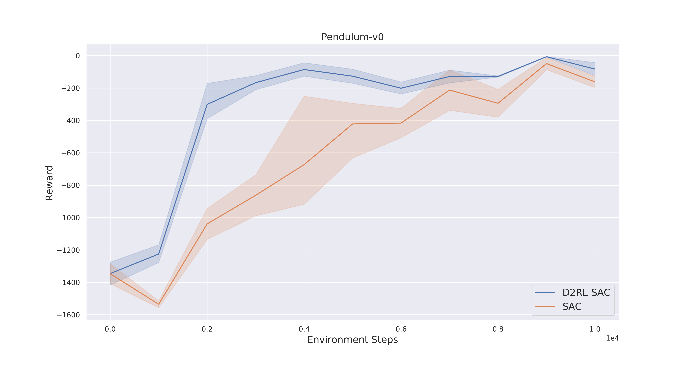
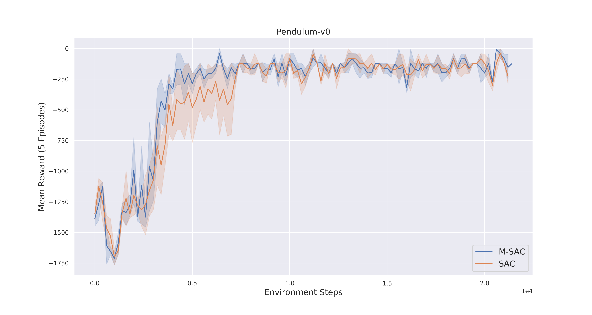
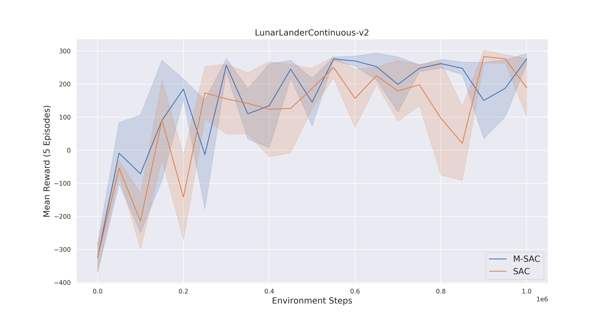

# Soft-Actor-Critic-and-Extensions
PyTorch implementation of **Soft-Actor-Critic** with the Extensions **PER** + **ERE** + **Munchausen RL** and the option for Multi-Environments for parallel data collection and faster training.
_____________
This repository includes the newest Soft-Actor-Critic version ([Paper 2019](https://arxiv.org/abs/1812.05905)) as well as extensions for SAC:
- **P**rioritized **E**xperience **R**eplay ([PER](https://arxiv.org/abs/1511.05952))
- **E**mphasizing **R**ecent **E**xperience without Forgetting the Past([ERE](https://arxiv.org/abs/1906.04009))
- Munchausen Reinforcement Learning [Paper](https://arxiv.org/abs/2007.14430) 
- D2RL: DEEP DENSE ARCHITECTURES IN REINFORCEMENT LEARNING [Paper](https://arxiv.org/pdf/2010.09163.pdf)
- Parallel Environments

In the paper implementation of ERE the authors used and older version of SAC, whereas this repository contains the newest version of SAC as well as a Proportional Prioritization implementation of PER. 

#### TODO:
- add IQN Critic [  ]
- Check performance with all add-ons [  ]

#### Dependencies
Trained and tested on:
<pre>
Python 3.6
PyTorch 1.4.0  
Numpy 1.15.2 
gym 0.10.11 
</pre>

## How to use:
The new script combines all extensions and the add-ons can be simply added by setting the corresponding flags.

`python run.py -info sac`

**Parameter:**
To see the options:
`python run.py -h`

<pre>
-env, Environment name, default = Pendulum-v0
-per, Adding Priorizied Experience Replay to the agent if set to 1, default = 0
-munchausen, Adding Munchausen RL to the agent if set to 1, default = 0
-d2rl, Uses Deep Actor and Deep Critic Networks if set to 1, default = 0
-ere, Adding Emphasizing Recent Experience to the agent if set to 1, default = 0
-info, Information or name of the run
-frames, The amount of training interactions with the environment, default is 100000
-eval_every, Number of interactions after which the evaluation runs are performed, default = 5000
-eval_runs, Number of evaluation runs performed, default = 1
-seed, Seed for the env and torch network weights, default is 0
-lr_a, Actor learning rate of adapting the network weights, default is 5e-4
-lr_c, Critic learning rate of adapting the network weights, default is 5e-4
-a, --alpha, entropy alpha value, if not choosen the value is leaned by the agent
-layer_size, Number of nodes per neural network layer, default is 256
-repm, --replay_memory, Size of the Replay memory, default is 1e6
-bs, --batch_size, Batch size, default is 256
-t, --tau, Softupdate factor tau, default is 1e-2
-g, --gamma, discount factor gamma, default is 0.99
--saved_model, Load a saved model to perform a test run!
-w, --worker, Number of parallel worker (attention, batch-size increases proportional to worker number!), default = 1
</pre>

## old scripts

with the old scripts you can still run three different SAC versions 

*Run regular SAC:* `python SAC.py -env Pendulum-v0 -ep 200 -info sac`

*Run SAC + PER:* `python SAC_PER.py -env Pendulum-v0 -ep 200 -info sac_per`

*Run SAC + ERE + PER:* `python SAC_ERE_PER.py -env Pendulum-v0 -frames 20000 -info sac_per_ere`

For further input arguments and hyperparameter check the code.

### Observe training results
  `tensorboard --logdir=runs`

## Results 
It can be seen that the extensions not always bring improvements to the algorithm. This is depending on the environment and from environment to environment different - as the authors mention in their paper (ERE).





- All runs without hyperparameter-tuning

## Comparison SAC and D2RL-SAC



## Comparison SAC and M-SAC




## Help and issues:
Im open for feedback, found bugs, improvements or anything. Just leave me a message or contact me.


## Author
- Sebastian Dittert

**Feel free to use this code for your own projects or research.**
```
@misc{SAC,
  author = {Dittert, Sebastian},
  title = {PyTorch Implementation of Soft-Actor-Critic-and-Extensions},
  year = {2020},
  publisher = {GitHub},
  journal = {GitHub repository},
  howpublished = {\url{https://github.com/BY571/Soft-Actor-Critic-and-Extensions}},
}
```
